<h1 align="center">Hi, I'm Nathan Yan 👋</h1>

  <b>Full Stack Developer · Java & Spring Enthusiast</b> 
  <i>Building robust back-ends and clean front-ends, one commit at a time.</i>

### About me

- 🎯 Focused on **Java + Spring Boot** ecosystem
- 🌱 Currently deepening knowledge in **REST APIs, JPA/Hibernate and Spring Security**
- 🔨 Practicing clean architecture and SOLID principles in personal projects
- 💬 Open to discuss Java, TypeScript and web development in general
- 📫 Reach me at **nathan.yan@zohomail.com**

> *"The people who are crazy enough to think they can change the world are the ones who do"*
> — **Steve Jobs**

---

### 🛠️ Tech Stack

#### Back-end

#### Front-end

#### Tools & Version Control

---

### 📊 GitHub Stats

  

---

### 🤝 Let's connect

  
  &nbsp;
  

