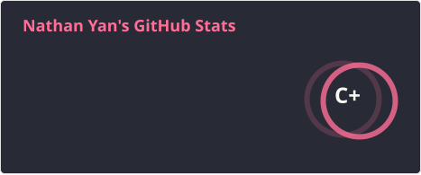
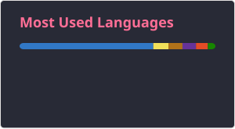

<h1 align="center">Hi, I'm Nathan Yan 👋</h1>

  <b>Python Developer · Web Automation & RPA</b> 
  <i>IT Intern at SNG Synergroup · Computer Science student</i>

### About me

- 🤖 Main author of a production RPA system in **Python** that collects tax certificates from government portals
- 🔐 Experience with **Playwright**, **digital certificate auth (ICP-Brasil/PKI)** and **pytest**
- 💻 Also build dashboards and integrations with **Next.js + Node.js**
- ☕ Personal projects in **Java + Spring Boot**
- 📫 **nathan.yan@zohomail.com**

---

### 🛠️ Tech Stack

#### Automation & Back-end

#### Front-end

#### Databases & Tools

---

### 📊 GitHub Stats

  

---

### 🤝 Let's connect

  
  &nbsp;
  

